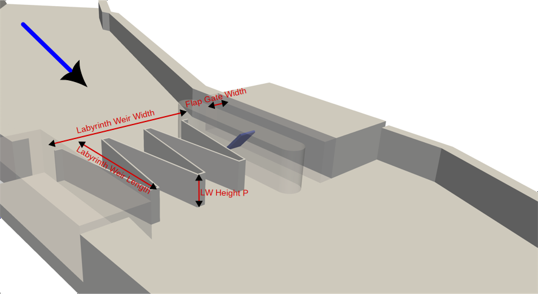
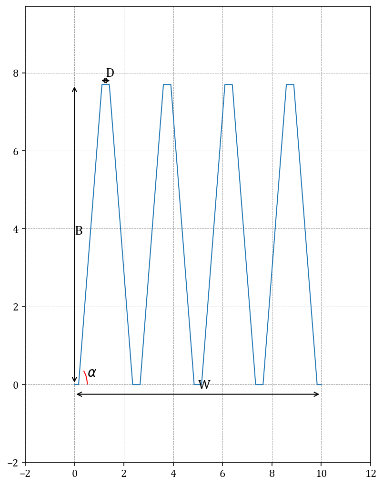
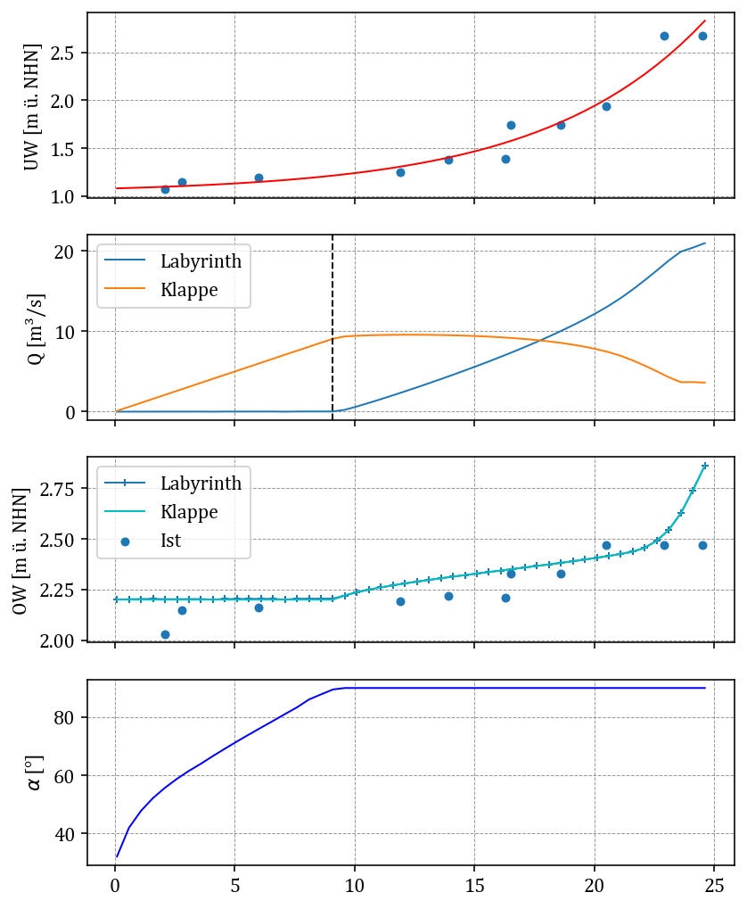

<br>
# ENGINEER
Welcome to the ENGINEER project (**En**twicklun**g** standardisierter **In**formationsmodelle für die Planung am B**e**ispiel von Labyrinth-W**e**h**r**anlagen)!

The ENGINEER project is developing an automated digital design for labyrinth weir structures. The project was funded by [mFUND](https://bmdv.bund.de/DE/Themen/Digitales/mFund/Projekte/mfund-projekte.html). Participants include the [BAW](https://www.baw.de), [WNA Magdeburg](https://www.wna-magdeburg.wsv.de/Webs/WNA/WNA-Magdeburg/DE/Startseite/startseite_node.html), [Arcadis](https://www.arcadis.com/de-de) and [Cadcom](https://cadcom.de/). The project is funded until end of February 2025. After that, further development will be limited to minor bug fixes as needed and subject to availability of resources.

This repository contains the Python scripts for the hydraulic design of labyrinth weir structures developed by BAW. This is only a small part of the developements from the ENGINEER project but it might be useful for you.

>[!WARNING]
>The developed source code is the result of a research project. BAW does not accept any responsibility for the correctness of the code or the results achieved with it. This program is distributed in the hope that it will be useful, but WITHOUT ANY WARRANTY; without even the implied warranty of MERCHANTABILITY or FITNESS FOR A PARTICULAR PURPOSE. See the
[GNU General Public License](LICENSE) for more details.

Currently the code is written in "Denglish" which is a mixture of German and English language. Sorry for that. We are working on it. Volunteers are welcome to help with the translation.

# Usage
## General considerations
This code can be used to design labyrinth weir structures consisting of a labyrinth weir and a parrallel flap gate. Furthermore, it is possible to estimate the hydraulic effect of the system over a given discharge range. You can find more information about labyrinth weirs in the BAWMitteilungen Nr. 105[^fn1]. The hydraulic calculation is based on the formulas published by Crookston & Tullis (2013)[^fn2] and Tullis et al. (2007)[^fn3].
This repository consists mainly of two Python files:
* <pre>engineer.py</pre> This ist the brain. You should not modify this file unless you find an bug or want to develop the project further.<br><br>
* <pre>example.py</pre> This is an application example. Feel free to adapt this file according to your wishes and your project. You will find all the code snippets from this README.md in example.py.

## Prerequisites
You need to have the following python libraries installed on your system:
<pre>numpy matplotlib os shutil pandas math re sys scipy</pre>
We recommend installing these either with [pip](https://packaging.python.org/en/latest/tutorials/installing-packages/) or [conda](https://docs.conda.io/projects/conda/en/23.3.x/user-guide/getting-started.html).<br><br>
Example of installation with pip:
<pre>pip install numpy matplotlib os shutil pandas math re sys scipy</pre>
Example of installation with conda:
<pre>conda install numpy matplotlib os shutil pandas math re sys scipy</pre>

## Hydraulic Design

### Case 1: You already know the geometry of your labyrinth weir


If you already know the geometry of your labyrinth weir you can plot it and calculate the upstream water level depending on the geometry, the discharge and the downstream water level. You can initialise an object `lab` from the class `labyrinth` and calculate the upstream water level as shown below.

```python
   labyrinth_weir = Labyrinth(bottom_level=0.1,  # bottom height [m]
                              downstream_water_level=1.09,  # downstream Water level [m]
                              discharge=10,  # discharge [m3/s]
                              labyrinth_width=15,  # labyrinth weir width [m]
                              labyrinth_height=2.2,  # labyrinth weir height [m]
                              labyrinth_length=8,  # labyrinth weir length in flow direction [m]
                              labyrinth_key_angle=8,  # key angle [degree]
                              D=0.5)  # front wall width [m]
```

The object `labyrinth_weir` includes the attributes overflow height `labyrinth_weir.hu` and the absolute upstream water level `labyrinth_weir.yu`. In case you change any attribute, e.g. the labyrinth weir 
height `labyrinth_weir.P`, you have to rerun the hydraulic calculation with `labyrinth_weir.update()`.

Furthermore, you can output a summary of the input and output parameters of the calculation:
```python
  labyrinth_weir.verbose = 1
  labyrinth_weir.print_results()
```

The output looks similar to:

<pre>
  Key Laenge = 8.00 [m] 
  Key Frontwand = 0.5 [m]
  Key Winkel = 8 [°]
  Key Wandstaerke = 0.3 [m]
  Key Hoehe = 2.20 [m]
  Key Anzahl = 4 
  Key Weite = 3.25 [m] 
  Keys Weite = 12.99 [m] 
  Seite Weite[S] = 2.01 [m] 
  Wehr Weite = 15.00 [m] 
  L/W = 4.71 [m] 
  Hu = 0.18 [m] 
  hu = 0.17 [m] 
  Kein Rückstaueinfluss! 
</pre>

### Case 2: You know how large your construction site is, how high the weir should be and the design discharge. Let ENGINEER design the labyrinth itself.

In this case, ENGINEER will design the labyrinth weir to fit your construction site and to ensure the lowest possible upstream water level at the specified design discharge.<br/><br/>
First, define your bounday conditions:

```python
bottom_level = 0.1  # bottom height [m]
labyrinth_width = 10  # available width for the labyrinth weir [m]
labyrinth_length = 8  # available length in flow direction for the labyrinth weir [m]
design_discharge = 20  # design discharge [m3/s]
design_downstream_water_level = 1.8  # downstream water level at design discharge [m]
labyrinth_crest_height = 2.2  # crest height of labyrinth weir [m] 
```

Then start the optimization:
```python
optimized_labyrinth = optimize_labyrinth_geometry(labyrinth, bottom_level, design_downstream_water_level, design_discharge,
                                         labyrinth_width, labyrinth_crest_height - bottom_level + 0, labyrinth_length,
                                         path='', show_plot=False)

```
This code gives you the object ```optimized_labyrinth```, which is an instance of the class ```labyrinth```. Now you can continue to work with it, as in Case 1.

Again, you can postprocess your ```optimized_labyrinth```:
```python
optimized_labyrinth.plot_geometry()     #plot the optimized geometry (see plot below)
optimized_labyrinth.verbose = 1         #print output
optimized_labyrinth.print_results()     #print result parameters
```



### Flap Gate
<br>
The objects of the class ```flap_gate``` work similar to the class ```labyrinth```. You have to define the maximum height of the flap gate, the angle to the horizontal, the discharge and the downstream water level. The object will calculate the upstream water level:
```python
flap_gate = FlapGate(bottom_level=0.1,  # bottom height [m]
                   downstream_water_level=1.09,  # downstream water level [m]
                   discharge=10,  # discharge [m3/s]
                   flap_gate_width=1.4,  # flap width [m]
                   flap_gate_height=2.35,  # flap height [m]
                   flap_gate_angle=74)  # flap angle [degree]
```
The upstream water level is calculated according to Bollrich (2019)[^fn4]. <br><br>
To print to overflow height, do:
```python
print(flap_gate.hu)
2.7284763202006874
```

## Operational Model
<br>
The labyrinth weir and the flap gate are coupled via the common upstream water level. The discharge is distributed depending on the capacity of the two parts. This coupling is automatically done in the code with the function `coupling`. As the total discharge increases, the valve is opened further and further to ensure that the legally required design water level is maintained. As soon as the flap is fully lowered, the water begins to flow over the labyrinth weir.  This is implemented by the `operational_model` function.<br><br>
To use the `operational_model` the following steps are required:
1. The discharge and the downstream rating curve must be defined. Both must be defined as a numpy array.
   ```python
   discharge = np.array([
        2.09,
        2.79,
        6.01,
        11.90,
        13.90,
        16.30,
        16.50,
        18.60,
        20.50,
        22.90,
        24.50])
   ```
    
   ```python
    downstream_water_level = np.array([
          1.07,
          1.15,
          1.19,
          1.25,
          1.38,
          1.39,
          1.74,
          1.74,
          1.94,
          2.67,
          2.67])
   ```
   The model will calculate a continuous discharge curve in steps of 0.1 l/s and interpolate discharges and tailwater levels for this purpose. To do this, you have to choose an interpolation method. To try out the available interpolation methods, the  `interpolate_downstream_curve` function can be used.
   ```python
   interpolate_downstream_curve(discharge,downstream_water_level,interpolation='all',show_plot=True, save_plot=False)
   ```
   <br>
   Please interpret the plot with engineering expertise and decide on the interpolation method that best matches the given tailwater levels.
  

   
3. We assume that the planning will replace an existing control structure and that the future water level must be compared with the current water level in order to prove that the discharge capacity remains unchanged. Therefore, the current water level must be specified for the discharge points given from step 1:
   ```python
   downstream_water_level = np.array([
            2.03,
            2.15,
            2.16,
            2.19,
            2.22,
            2.21,
            2.33,
            2.33,
            2.47,
            2.47,
            2.47])
    ```

4. An instance of the class `flap_gate` and the class `labyrinth` must be initialized as explained above. For doing this, either a self-designed labyrinth weir or the optimized one from case 2 can be used.
   
6. In order to operate the valve, the following data is required: the design water level and the maximum angle of the flap to the horizontal. Now the operational model can be initialized.
   ```python
   results, results_events = operational_model(labyrinth_object=optimized_labyrinth,
                                               flap_gate_opject=flap_gate,
                                               discharge_vector=discharge,
                                               downstream_water_level_vector=downstream_water_level,
                                               upstream_water_level_vector=upstream_water_level_today,
                                               design_upstream_water_level=design_upstream_water_level,
                                               max_flap_gate_angle=max_flap_gate_angle,
                                               fish_body_height=fish_body_height,
                                               interpolation_method='exponential',
                                               show_plot=False,
                                               save_plot=False)
    ```

8. The return value is two variables of the type [pandas.DataFrame](https://pandas.pydata.org/docs/reference/api/pandas.DataFrame.html): results and results_evens:
   - `results` contains discharge, downstream water level, upstream water level, discharge over the labyrinth weir, discharge over the flap gate and flap angle for the following range: `np.arange(min(discharge), max(discharge), 0.1)`.
   - `results_events` contains the same parameters as `results` but for the grid point given in `discharge`.
   - In addition, a figure is displayed that contains the following representations (from top to bottom): downstream water level grid points and interpolation curve, fractions of discharge over labyrinth weir and flap gate, upstream water level in the design and actual state, flap angle. The x-axis of all plots indicates the total discharge through the system.<br>
   <br>
   

# Literature
[^fn1]: Bundesanstalt für Wasserbau (Hg.) (2020): Feste Wehre an Bundeswasserstraßen: Untersuchungen zur Machbarkeit sowie Empfehlungen zur Umsetzung. Karlsruhe: Bundesanstalt für Wasserbau (BAWMitteilungen, 105). [https://hdl.handle.net/20.500.11970/107132](https://hdl.handle.net/20.500.11970/107132)

[^fn2]: Crookston, B. M.; Tullis, B. P. (2013): Hydraulic Design and Analysis of Labyrinth Weirs. I: Discharge Relationships. In: Journal of Irrigation and Drainage Engineering
139 (5), S. 363–370. [https://doi.org/10.1061/(ASCE)IR.1943-4774.0000558](https://doi.org/10.1061/(ASCE)IR.1943-4774.0000558)

[^fn3]: Tullis, B. P.; Young, J. C.; Chandler, M. A. (2007): Head-Discharge Relationships for Submerged Labyrinth Weirs. In: J. Hydraul. Eng. 133 (3), S. 248–254. [https://doi.org/10.1061/(ASCE)0733-9429(2007)133:3(248)](https://doi.org/10.1061/(ASCE)0733-9429(2007)133:3(248))

[^fn4]: Bollrich, Gerhard (2019): Technische Hydromechanik 1. Grundlagen. Berlin: Beuth Verlag GmbH.

  
