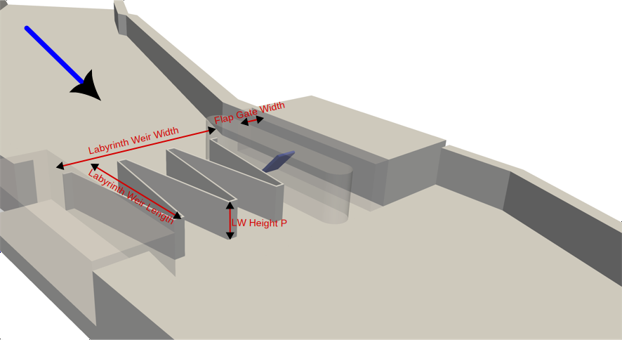
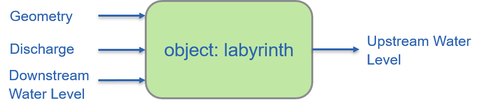
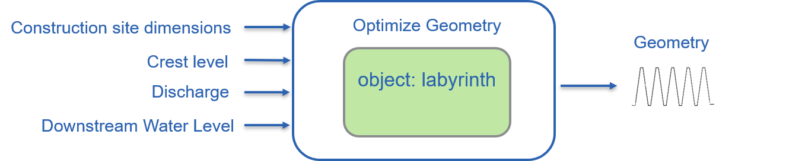
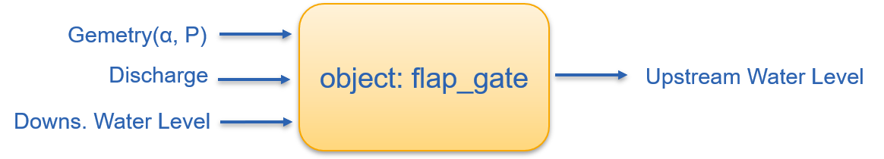
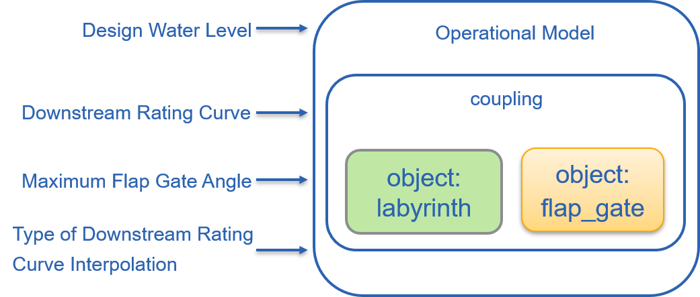
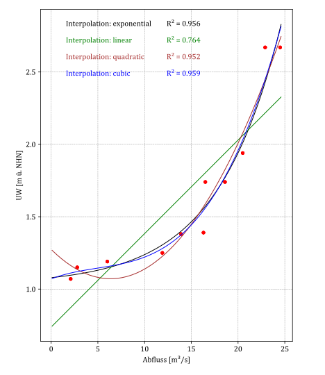

# ENGINEER
Welcome to the ENGINEER project (**En**twicklun**g** standardisierter **In**formationsmodelle für die Planung am B**e**ispiel von Labyrinth-W**e**h**r**anlagen)!

The ENGINEER project is developing an automated digital design for labyrinth weir structures. The project was funded by [mFUND](https://bmdv.bund.de/DE/Themen/Digitales/mFund/Projekte/mfund-projekte.html). Participants include the [BAW](www.baw.de), [WNA Magdeburg](https://www.wna-magdeburg.wsv.de/Webs/WNA/WNA-Magdeburg/DE/Startseite/startseite_node.html), [Arcadis](https://www.arcadis.com/de-de) and [Cadcom](https://cadcom.de/).

This repository contains the Python scripts for the hydraulic design of labyrinth weir structures developed by BAW.

>[!WARNING]
>The developed source code is the result of a research project. BAW does not accept any responsibility for the correctness of the code or the results achieved with it. This program is distributed in the hope that it will be useful, but WITHOUT ANY WARRANTY; without even the implied warranty of MERCHANTABILITY or FITNESS FOR A PARTICULAR PURPOSE. See the
GNU General Public License for more details.

# Usage
## General considerations
This development can be used to design labyrinth weir structures consisting of a labyrinth weir and a parrallel flap gate. Furthermore, it is possible to estimate the hydraulic effect of the system over a given discharge spectrum. You can find more information about labyrinth weirs in the BAWMitteilungen Nr. 105[^fn1]. The hydraulic calculation is based on the formulas published by Crookston & Tullis (2013)[^fn2] and Tullis et al. (2007)[^fn3]<br>
This repository consists of two Python files, among other things:
* <pre>engineer.py</pre> This ist the brain. You should not modify this file unless you find an bug or want to further develop the project.
* <pre>example.py</pre> This is an usage example. Feel free to adapt this file according to your wishes and your project. You will find all the code snippets from this README.md in example.py.

## Prerequisites
You need to have installed the following python libraries on your system:
<pre>numpy matplotlib os shutil pandas math re sys winreg scipy</pre>
We recommend installing it either with pip or conda.<br><br>
Example with pip:
<pre>pip install numpy matplotlib os shutil pandas math re sys winreg scipy</pre>
Example with conda:
<pre>conda install numpy matplotlib os shutil pandas math re sys winreg scipy</pre>

## Hydraulic Design

### Case 1: You already know the geometry of your labyrinth weir


If you already know the geometry of your labyrinth weir you can plot it and calculate the upstream water level depending on the geometry, the discharge and the donwstream water level.
```python
  lab = labyrinth(  bottom_height=0.1,                          #bottom height [m]  
                    downstream_water_level=1.09,                #downstream Water level [m]
                    Q=10,                                       #discharge [m3/s]
                    labyrinth_width=15,                         #labyrinth weir width [m]
                    labyrinth_height=2.2,                       #labyrinth weir height [m]
                    labyrinth_length=8,                         #labyrinth weir length in flow direction [m]
                    key_angle=8,                                #key angle [degree]
                    D=0.5)                                      #front wall width [m]
```
Now, the object `lab` from the class `labyrinth` is initialized and the upstream water level is calculated.<br>
The overflow height `lab.hu`, or the absolute upstream water level `lab.yu` are now atributes of the objcet `lab`. In case that you change any atribut, e.g. the labyrinth weir 
height `lab.P` you have to rerun the hydraulic calculation with `lab.update()`.<br>
Furthermor you can get a text output of the calculation:
```python
  lab.verbose = 1
  lab.print_results()
```
<pre>
  Key Laenge = 8.00 [m] 
  Key Frontwand = 0.5 [m]
  Key Winkel = 8 [°]
  Key Wandstaerke = 0.3 [m]
  Key Hoehe = 2.20 [m]
  Key Anzahl = 4 
  Key Weite = 3.25 [m] 
  Keys Weite = 12.99 [m] 
  Seite Weite[S] = 2.01 [m] 
  Wehr weite = 15.00 [m] 
  L/W = 4.71 [m] 
  Hu = 0.18 [m] 
  hu = 0.17 [m] 
  Kein Rückstaueinfluss! 
</pre>

### Case 2: You know how large your construction site is, how high the weir should be and the design discharge. Let ENGINEER design the labyrinth itself.

In this case, ENGINEER will design the labyrinth weir to fit your construction field and to ensure that the lowest possible upstream water level occurs at the specified design discharge.<br><br>

First, define your bounday conditions:
```python
bottom_level = 0.1      #bottom height [m o SL]
available_width = 10    #available width for the labyrinth weir [m]
available_length = 8    #available length in flow direction for the labyrinth weir [m]
Q_HQ = 20               #design discharge [m3/s]
UW_HQ = 1.8             #downstream water level at design discharge [m]
OK_Labyrinth = 2.2      #crest height of labyrinth weir [m]    
```

Second, start the optimization:
```python
bestLab = optimize_labyrinth(labyrinth, bottom_level, UW_HQ, Q_HQ, available_width, OK_Labyrinth-bottom_level, available_length, path='', show_plot=True)
```
As a result, you get the object ```bestLab``` of the class ```labyrinth```. You can continue to work with it as in Case 1.

Again, you can postprocess your ```bestLab```:
```python
bestLab.plot_geometry()     #plot the optimized geometry
bestLab.verbose = 1         #print output
bestLab.print_results()     #print result parameters
```

### Flap Gate
<br>
The objects of the class ```flap_gate``` work simular like the class ```labyrinth``` . You have to define the maximum height of the flap gate, the angle against the vertical, the discharge and the downstream water level. The object will calculate the upstream water level:
```python
kla  = flap_gate(  bottom_height=0.1,       #bottom height [m]
                  UW=1.09,                  #downstream water level [m]
                  Q=10,                     #discharge [m3/s]
                  flap_gateBreite=1.4,      #flap width [m]
                  flap_gateHoehe=2.35,      #flap height [m]
                  flap_gateWinkel=74)       #flap angle [degree]
```
The upstream water level is calculated according to Bollrich (2019)[^fn4]. <br>
To print to overflow height, do:
```python
print(kla.hu)
2.7284763202006874
```

## Operational Model
<br>
The labyrinth weir and gate are coupled via the common upstream water level. The discharge is divided depending on the capacity of the two parts. This coupling is automatically done in the code with the function `coupling`. As the total discharge increases, the valve is opened further and further to ensure that the legally required design water level is maintained. As soon as the flap is fully lowered, the water begins to flow over the labyrinth weir.  This is implemented by the `operational_model` function.<br>
To use the `operational_model` the following steps are required:
1. The discharge and the downstream rating curve must be defined. Both is has to be defined as a numpy array.
   ```python
   discharge = np.array([
        2.09,
        2.79,
        6.01,
        11.90,
        13.90,
        16.30,
        16.50,
        18.60,
        20.50,
        22.90,
        24.50])
   ```
    
   ```python
    downstream_water_level = np.array([
          1.07,
          1.15,
          1.19,
          1.25,
          1.38,
          1.39,
          1.74,
          1.74,
          1.94,
          2.67,
          2.67])
   ```
   The model will calculate a continuous discharge curve and interpolate discharges and tailwater levels for this purpose. To do this, you have to decide on an interpolation method. To try out the available interpolation methods, the  `interpolate_downstream_curve` function can be used.
   ```python
   interpolate_downstream_curve(discharge,downstream_water_level,interpolation='all',show_plot=True, save_plot=False)
   ```
   <br>
   Please consider the plot with engineering expertise and decide on the interpolation method that best matches the given tailwater levels.
  

   
3. bla... 


# Literature
[^fn1]: Bundesanstalt für Wasserbau (Hg.) (2020): Feste Wehre an Bundeswasserstraßen: Untersuchungen zur Machbarkeit sowie Empfehlungen zur Umsetzung. Karlsruhe: Bundesanstalt für Wasserbau (BAWMitteilungen, 105). [https://hdl.handle.net/20.500.11970/107132](https://hdl.handle.net/20.500.11970/107132)

[^fn2]: Crookston, B. M.; Tullis, B. P. (2013): Hydraulic Design and Analysis of Labyrinth Weirs. I: Discharge Relationships. In: Journal of Irrigation and Drainage Engineering
139 (5), S. 363–370. [https://doi.org/10.1061/(ASCE)IR.1943-4774.0000558](https://doi.org/10.1061/(ASCE)IR.1943-4774.0000558)

[^fn3]: Tullis, B. P.; Young, J. C.; Chandler, M. A. (2007): Head-Discharge Relationships for Submerged Labyrinth Weirs. In: J. Hydraul. Eng. 133 (3), S. 248–254. [https://doi.org/10.1061/(ASCE)0733-9429(2007)133:3(248)](https://doi.org/10.1061/(ASCE)0733-9429(2007)133:3(248))

[^fn4]: Bollrich, Gerhard (2019): Technische Hydromechanik 1. Grundlagen. Berlin: Beuth Verlag GmbH.

  
